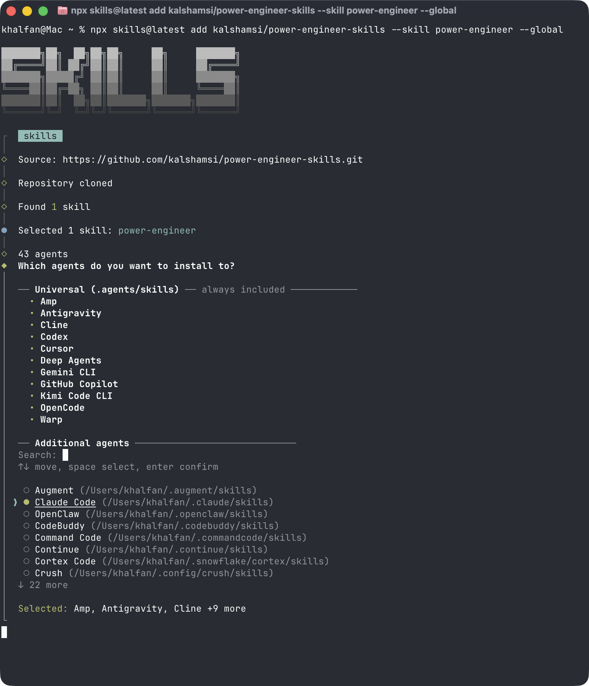

<p align="center">
  <h1 align="center">Power Engineer</h1>
  <p align="center">
    The skill stack manager for Claude Code.<br>
    Scan. Interview. Install. Configure. Done.
  </p>
  <p align="center">
    <a href="https://github.com/kalshamsi/power-engineer-skills/releases/tag/v1.3.0"></a>
    <a href="LICENSE"></a>
    
    
    
  </p>
</p>

---

## Quick start (under 2 minutes)

**Step 1 — Install**

```bash
npx skills@latest add kalshamsi/power-engineer-skills --skill power-engineer --global
```

Select which agents to install on — use arrow keys to navigate and **space to select**.



**Step 2 — Run**

```
/power-engineer
```

**Step 3 — Done.** Skills are installed and active immediately.

> Power Engineer scans your codebase, asks 5–7 adaptive questions, and installs the right skills directly. No scripts. No copy-paste.

---

## What is Power Engineer? (Beginner guide)

**Power Engineer** is an intelligent project setup skill for [Claude Code](https://docs.anthropic.com/en/docs/claude-code). It replaces the manual process of researching, picking, and installing skills one by one with a single automated run.

### What does Power Engineer do?

```
Scan codebase → Adaptive interview → Resolve skills → Install → Configure → Track drift
```

1. **Scans your project** — detects language, framework, SDKs, infrastructure, cloud, brand assets, existing skills, team size, and project maturity
2. **Asks only what it can't infer** — 12 questions total, typically 5–7 asked after auto-detection
3. **Installs skills directly** — real-time execution with progress tracking and failure handling
4. **Configures your project** — generates CLAUDE.md, state directory, skill patching with project context
5. **Tracks drift** — on re-run, detects changes to your stack and recommends new skills

### Quality-of-Life features (v1.3.0)

| Feature | What it does |
|---------|-------------|
| **Proactive memory management** | Auto-saves project knowledge across sessions — decisions, patterns, and context persist without manual effort |
| **Context resilience** | Post-compaction hooks and 60% proactive compaction keep critical context alive through long sessions |
| **Universal AskUserQuestion** | Enforced across all conversations, not just skills — Claude always confirms before destructive or ambiguous actions |
| **Skill health checks** | On `update`, detects healthy / missing / broken / orphaned skills and recommends fixes |
| **Cross-tool config sync** | Generates `.cursorrules`, `copilot-instructions.md`, and `.windsurfrules` from your CLAUDE.md so all AI tools share the same context |
| **Session orchestration** | Start/end protocols, subagent awareness, and handoff protocol for multi-session workflows |
| **Full output regeneration** | Re-runs regenerate all output files completely — no more silent failures from partial writes |

### What are Claude Code skills?

Skills are reusable instruction sets that extend what Claude can do inside your project. A `test-driven-development` skill teaches Claude TDD. A `systematic-debugging` skill gives it structured root-cause analysis. Skills activate by name (`/skill-name`) or automatically when Claude detects the right context.

**Power Engineer curates 224 of them** across 16 catalog files and installs exactly the ones your project needs.

---

## Command reference

All commands are prefixed with `power engineer` in chat (e.g., `power engineer frontend`).

| Command | Description |
|---------|-------------|
| `/power-engineer` | Full interview — scan, questionnaire, install, configure |
| `quick` | Auto-detect stack, minimal questions, smart defaults |
| `frontend` | Frontend and design skills only |
| `backend` | Backend, API, and database skills only |
| `devops` | DevOps and infrastructure skills only |
| `ai` | AI, LLM, and agentic skills only |
| `data` | Data, ML, and research skills only |
| `docs` | Documentation skills only |
| `mobile` | Mobile development skills only |
| `status` | Show installed skills and drift report (read-only) |
| `update` | Detect project changes, install recommended skills |
| `catalog` | Browse the full skill catalog interactively |
| `help` | Show installed skills with trigger phrases and usage hints |
| `configure` | Manage preferences — security level, auto-update toggle |

---

## Catalog

224 skills across 16 catalog files. Browse at [`power-engineer/references/catalog/`](./power-engineer/references/catalog/) or start with [`INDEX.md`](./power-engineer/references/catalog/INDEX.md).

| Category | What's included |
|----------|----------------|
| **Core & Planning** | obra/superpowers methodology, mattpocock planning, GitHub copilot workflows |
| **Anthropic Official** | Document generation (docx/pptx/xlsx/pdf), design, skill creation |
| **Backend & Architecture** | API design, TypeScript, Node.js patterns, database schemas, auth, payments |
| **DevOps & Infrastructure** | Docker, Terraform, Helm, CI/CD, migrations, runbooks |
| **Data & ML** | Data engineering, data science, ML/MLOps, computer vision |
| **Testing & Quality** | Playwright, TDD, tech debt tracking, code review, onboarding |
| **Agentic AI** | AI/LLM SDKs, MCP builders, agent patterns, Vercel AI SDK |
| **Security & AppSec** | 57 skills + 16 MCP servers — SAST, DAST, SCA, secrets, containers, IaC, threat modeling, compliance, pentest, DFIR |
| **Frontend** | React/Next.js, Vue/Vite, design systems, shadcn/ui, Stitch |
| **Mobile** | Expo, React Native, SwiftUI/iOS |
| **Cloud & Databases** | Microsoft Azure, Neon, Supabase, Better Auth |
| **Docs & Research** | Technical writing, web research, Firecrawl, Tavily |
| **Power Suites** | GSD, Superpowers, UI/UX Pro Max, Designer Skills, Stitch, Pencil |

---

## Security

Every project gets baseline security by default — no extra steps:

| Level | What's included |
|-------|----------------|
| **Standard** (default) | Sentry security-review (#1 rated), OWASP Top 10:2025, secrets detection |
| **Enhanced** | Standard + HTTP headers audit, crypto audit, API security testing |
| **Maximum** | Enhanced + Bandit SAST, Socket SCA, Docker Scout, security test generation, DevSecOps pipeline |
| **Compliance** | Maximum + PCI-DSS v4.0 audit, OWASP Mobile Top 10:2024 |
| **Custom** | Cherry-pick from all available security skills |

Additional specialized options: Deep SAST/DAST (Semgrep, CodeQL, Nuclei), Container & IaC (Trivy, Grype, Checkov), Penetration testing (SecLists, Burp Suite), Threat modeling (STRIDE, MITRE ATT&CK). Framework-specific security (Django, Laravel, Spring Boot) is auto-added when detected.

Full security catalog: **57 skills, 16 MCP servers** — browse via `power engineer catalog`.

---

## After setup

Power Engineer creates the following in your project:

| File | Purpose |
|------|---------|
| `CLAUDE.md` | Project context with managed `## Power Engineer` section |
| `.power-engineer/state.json` | Skill inventory, preferences, scan snapshot for drift detection |
| `.power-engineer/cheatsheet.md` | Installed skills quick reference with trigger phrases |
| `.power-engineer/install-log.sh` | Audit log of all install commands (re-runnable) |
| `.power-engineer/brand.md` | Brand identity — colors, fonts, tokens (if applicable) |
| `.power-engineer/project-context.md` | Goals, team workflow, conventions |

### Adaptive questionnaire

| # | Topic | Auto-detected? |
|---|-------|:---:|
| Q1 | Project type | Yes |
| Q2 | Language / stack | Yes |
| Q3 | Framework | Yes |
| Q4 | Design needs | — |
| Q5 | Documentation needs | — |
| Q6 | Research / data needs | — |
| Q7 | Cloud / database | Yes |
| Q8 | Project phase | — |
| Q9 | Brand identity | Yes |
| Q10 | Team workflow | Yes |
| Q11 | Goals | — |
| Q12 | Security needs | — |

Questions marked **Yes** are skipped when the scan already has the answer.

---

## Architecture

```
power-engineer/
├── SKILL.md                          ← Router (14 commands, ~50 lines)
└── references/
    ├── modules/                      ← Composable instruction sets
    │   ├── scanner.md                ← Codebase analysis → ProjectProfile
    │   ├── questionnaire.md          ← Adaptive interview → SkillPlan
    │   ├── skill-resolver.md         ← SkillPlan → deduplicated install commands
    │   ├── installer.md              ← Direct execution with progress tracking
    │   ├── configurator.md           ← CLAUDE.md, state dir, cheatsheet, skill patching
    │   └── drift-detector.md         ← Compare state vs current project
    ├── flows/                        ← Route-specific module compositions
    │   ├── full-interview.md         ← Scan → Interview → Resolve → Install → Configure
    │   ├── quick.md                  ← Scan → smart defaults → Install → Configure
    │   ├── frontend.md               ← Targeted frontend skill flow
    │   ├── backend.md                ← Targeted backend skill flow
    │   ├── devops.md                 ← Targeted devops skill flow
    │   ├── ai.md                     ← Targeted AI/LLM skill flow
    │   ├── data.md                   ← Targeted data/research skill flow
    │   ├── docs.md                   ← Targeted documentation skill flow
    │   ├── mobile.md                 ← Targeted mobile skill flow
    │   ├── update.md                 ← Drift detection → resolve → install
    │   ├── catalog-browse.md         ← Interactive catalog browser
    │   ├── help.md                   ← Installed skills with triggers
    │   └── configure.md              ← Manage preferences
    └── catalog/                      ← 16 browsable skill catalog files
```

**Module pipeline:** Every flow composes from `Scanner → Questionnaire → Skill Resolver → Installer → Configurator`. The **Drift Detector** runs independently on `status` and `update` commands, and auto-runs when `preferences.auto_update` is enabled.

---

## Power Suites

Curated skill collections that install via specialized methods. Power Engineer presents these after the main installation.

| Suite | Install | Skills |
|-------|---------|--------|
| **GSD** | `npx get-shit-done-cc --claude` | Context engineering with phased execution and verification |
| **Superpowers** | `/plugin install superpowers@superpowers-marketplace` | Auto-triggering dev methodology — brainstorm, plan, TDD, verify |
| **UI/UX Pro Max** | `/plugin install ui-ux-pro-max@ui-ux-pro-max-skill` | 50+ styles, 97 palettes, 57 font pairings, 99 UX guidelines |
| **Designer Skills** | `/plugin marketplace add Owl-Listener/designer-skills` | 63 skills + 27 commands across 8 design disciplines |
| **Google Stitch** | `npx skills add google-labs-code/stitch-skills --all` | Text/sketch → high-fidelity UI → React/Tailwind code |
| **Pencil** | Built-in (VS Code extension) | Native `.pen` design file editor |

---

## Testing

Power Engineer has a two-layer testing story:

1. **Lint (CI, every PR)**: `tests/lint/` — catalog integrity, install
   syntax, doc structure, URL validation, scanner-rules verification.
   Runs on every pull request.
2. **Fixtures (CI + manual)**: `tests/fixtures/` — five project archetypes
   (Next.js+Supabase, Python+FastAPI, monorepo, blank, React Native+Expo).
   Scanner rules run automatically against each fixture in CI.

Questionnaire + resolver behavior is tested manually — see
`tests/README.md#known-coverage-gaps`.

Run the full lint suite locally:

```bash
bash tests/run-all.sh
```

---

## Contributing

See [**CONTRIBUTING.md**](docs/CONTRIBUTING.md) for the full guide — adding skills to the catalog, improving the tool, and submitting PRs.

**Quick version:**

1. Find the right file in `power-engineer/references/catalog/`
2. Add a row with all 6 columns: `Skill | Source | Install | Description | Trigger | When to use`
3. Run `bash tests/run-tests.sh`
4. Open a PR with a conventional commit message

---

## Credits & Attribution

Power Engineer does not author skills — it curates and installs them. Every skill in the catalog was built by open-source contributors. This project exists because of their work.

### Official sources

| Source | Maintainer | Contributions |
|--------|-----------|---------------|
| [anthropics/skills](https://github.com/anthropics/skills) | Anthropic | 12 official skills — document generation, design, skill creation |
| [anthropics/claude-cookbooks](https://github.com/anthropics/claude-cookbooks) | Anthropic | Cookbook audit for secrets detection |
| [github/awesome-copilot](https://github.com/github/awesome-copilot) | GitHub | Git commit, GitHub CLI, PRD, CodeQL |
| [microsoft/github-copilot-for-azure](https://github.com/microsoft/github-copilot-for-azure) | Microsoft | 6 Azure AI/cloud skills |
| [microsoft/azure-skills](https://github.com/microsoft/azure-skills) | Microsoft | Azure Foundry, quotas, upgrade, observability |
| [google-labs-code/stitch-skills](https://github.com/google-labs-code/stitch-skills) | Google | Stitch design-to-code pipeline (6 skills) |

### Core methodology

| Source | Maintainer | Contributions |
|--------|-----------|---------------|
| [obra/superpowers](https://github.com/obra/superpowers) | Jesse Vincent ([@obra](https://github.com/obra)) | 14 development methodology skills — TDD, planning, debugging, code review, worktrees |
| [mattpocock/skills](https://github.com/mattpocock/skills) | Matt Pocock ([@mattpocock](https://github.com/mattpocock)) | 12 planning & product skills — PRDs, grilling, refactoring, interface design |

### Major contributors

| Source | Contributions |
|--------|---------------|
| [alirezarezvani/claude-skills](https://github.com/alirezarezvani/claude-skills) | 20+ skills across DevOps, data, ML, testing, agentic AI, payments (plugin marketplace) |
| [trailofbits/skills](https://github.com/trailofbits/skills) | 14+ security skills — SAST, SCA, smart contracts, binary analysis |
| [inferen-sh/skills](https://github.com/inferen-sh/skills) | 12 AI SDK skills — Python/JS SDKs, chat UI, browser, code execution |
| [pbakaus/impeccable](https://github.com/pbakaus/impeccable) | 13 design refinement skills — polish, critique, animate, distill |
| [expo/skills](https://github.com/expo/skills) | 8 mobile skills — React Native, Expo workflows |
| [majiayu000/claude-skill-registry](https://github.com/majiayu000/claude-skill-registry) | 7 security skills — DAST, secrets detection, container scanning |
| [kalshamsi/claude-security-skills](https://github.com/kalshamsi/claude-security-skills) | 10 security skills — SAST, SCA, API testing, DevSecOps |
| [vercel-labs/agent-skills](https://github.com/vercel-labs/agent-skills) | 5 React/Vercel skills |
| [wshobson/agents](https://github.com/wshobson/agents) | 5 backend skills — API design, TypeScript, Node.js, Python, Tailwind |
| [affaan-m/everything-claude-code](https://github.com/affaan-m/everything-claude-code) | 5 skills — security review, framework-specific security |

### Individual skill authors

| Source | Contributions |
|--------|---------------|
| [getsentry/skills](https://github.com/getsentry/skills) | Security review |
| [agamm/claude-code-owasp](https://github.com/agamm/claude-code-owasp) | OWASP Top 10 + Agentic AI security |
| [shadcn/ui](https://github.com/shadcn/ui) | shadcn/ui component skill |
| [vercel/ai](https://github.com/vercel/ai) | Vercel AI SDK |
| [vercel/turborepo](https://github.com/vercel/turborepo) | Turborepo |
| [vercel-labs/next-skills](https://github.com/vercel-labs/next-skills) | Next.js best practices and caching |
| [vercel-labs/agent-browser](https://github.com/vercel-labs/agent-browser) | Browser automation |
| [antfu/skills](https://github.com/antfu/skills) | Vue and Vite skills |
| [hyf0/vue-skills](https://github.com/hyf0/vue-skills) | Vue 3 best practices |
| [firecrawl/cli](https://github.com/firecrawl/cli) | Web crawling and scraping |
| [tavily-ai/skills](https://github.com/tavily-ai/skills) | Real-time web search |
| [browser-use/browser-use](https://github.com/browser-use/browser-use) | Browser automation |
| [neondatabase/agent-skills](https://github.com/neondatabase/agent-skills) | Neon Postgres |
| [supabase/agent-skills](https://github.com/supabase/agent-skills) | Supabase Postgres |
| [better-auth/skills](https://github.com/better-auth/skills) | Better Auth |
| [ehmo/platform-design-skills](https://github.com/ehmo/platform-design-skills) | Apple HIG, Material Design 3, WCAG 2.2 |
| [avdlee/swiftui-agent-skill](https://github.com/avdlee/swiftui-agent-skill) | SwiftUI/iOS |
| [currents-dev/playwright-best-practices-skill](https://github.com/currents-dev/playwright-best-practices-skill) | Playwright testing |
| [charon-fan/agent-playbook](https://github.com/charon-fan/agent-playbook) | Self-improving agent patterns |
| [ctsstc/get-shit-done-skills](https://github.com/ctsstc/get-shit-done-skills) | GSD context engineering |
| [garrytan/gstack](https://github.com/garrytan/gstack) | CSO security |
| [MCKRUZ/security-review-skill](https://github.com/MCKRUZ/security-review-skill) | Security review |
| [fr33d3m0n/threat-modeling](https://github.com/fr33d3m0n/threat-modeling) | STRIDE/DREAD/MITRE threat modeling |
| [Tencent/AI-Infra-Guard](https://github.com/Tencent/AI-Infra-Guard) | OWASP ASI |
| [Sushegaad/Claude-Skills-Governance-Risk-and-Compliance](https://github.com/Sushegaad/Claude-Skills-Governance-Risk-and-Compliance) | GRC compliance |
| [Eyadkelleh/awesome-claude-skills-security](https://github.com/Eyadkelleh/awesome-claude-skills-security) | Security skills collection |
| [WolzenGeorgi/claude-skills-pentest](https://github.com/WolzenGeorgi/claude-skills-pentest) | Penetration testing |
| [jthack/ffuf_claude_skill](https://github.com/jthack/ffuf_claude_skill) | Fuzzing (ffuf) |
| [mukul975/Anthropic-Cybersecurity-Skills](https://github.com/mukul975/Anthropic-Cybersecurity-Skills) | Cybersecurity skills |
| [tsale/awesome-dfir-skills](https://github.com/tsale/awesome-dfir-skills) | DFIR incident response |
| [TheSethRose/Clawdbot-Security-Check](https://github.com/TheSethRose/Clawdbot-Security-Check) | Security checks |
| [aliksir/claude-code-skill-security-check](https://github.com/aliksir/claude-code-skill-security-check) | Skill security auditing |
| [larrygmaguire-hash/mcp-security-audit](https://github.com/larrygmaguire-hash/mcp-security-audit) | MCP security audit |
| [alissonlinneker/shield-claude-skill](https://github.com/alissonlinneker/shield-claude-skill) | Shield security |
| [Jeffallan/claude-skills](https://github.com/Jeffallan/claude-skills) | Multi-tool security review |
| [sickn33/antigravity-awesome-skills](https://github.com/sickn33/antigravity-awesome-skills) | SAST configuration, security |
| [AgentSecOps/SecOpsAgentKit](https://github.com/AgentSecOps/SecOpsAgentKit) | Container and IaC security |
| [TerminalSkills/skills](https://github.com/TerminalSkills/skills) | Nuclei, Grype, Checkov |

### Plugin suites

| Source | Suite |
|--------|-------|
| [obra/superpowers-marketplace](https://github.com/obra/superpowers-marketplace) | Superpowers plugin marketplace |
| [nextlevelbuilder/ui-ux-pro-max-skill](https://github.com/nextlevelbuilder/ui-ux-pro-max-skill) | UI/UX Pro Max (50+ styles, 97 palettes) |
| [Owl-Listener/designer-skills](https://github.com/Owl-Listener/designer-skills) | Designer Skills Collection (63 skills, 27 commands) |

Each skill's license is governed by its source repository. Power Engineer's catalog and tooling are [MIT](LICENSE)-licensed.

---

## License

[MIT](LICENSE)
